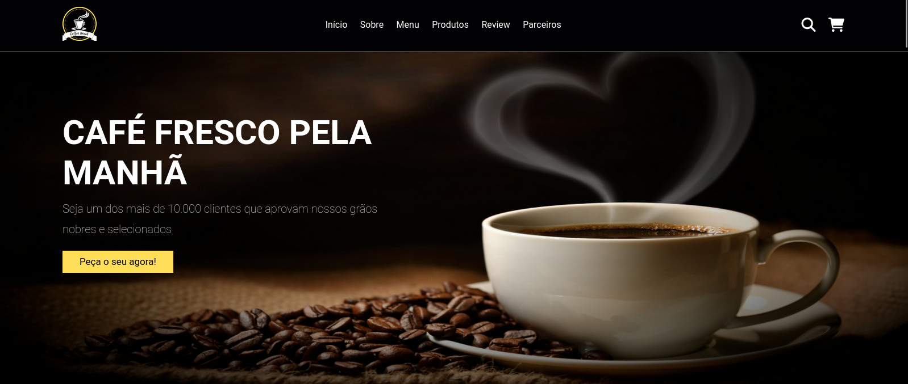

<h1 align="center">
  💻 Projeto - Loja Coffee Break
</h1>

<h4 align="center"><a href="https://portfoliopsyker.netlify.app/">Clique para visitar o projeto</a></h4>

## 📚 Seções

O site é composto por cinco seções:

- **Início:** Nele temos uma breve apresentação;
- **Sobre:** Nessa seção tenho uma descrição dizendo sobre o produto;
- **Menu:** Exibe Informações sobre os tipos de cafes disponiveis no site;
- **Produtos:** Apresenta alguns produtos desenvolvidos e criados po uma empresa de graos de café muito famoso;
- **Parceiros:** Mostra os parceiros da empresa e onde se localizam e os site de seus comércios online;
- **Review:** Nele exibe os comentários dos clientes satisfeitos com estrelas;

---

## 💼 Tecnologias utilizadas

Para o desenvolvimento deste site utilizei as seguintes tecnologias:

- HTML;
- JavaScript;
- Css;

---
